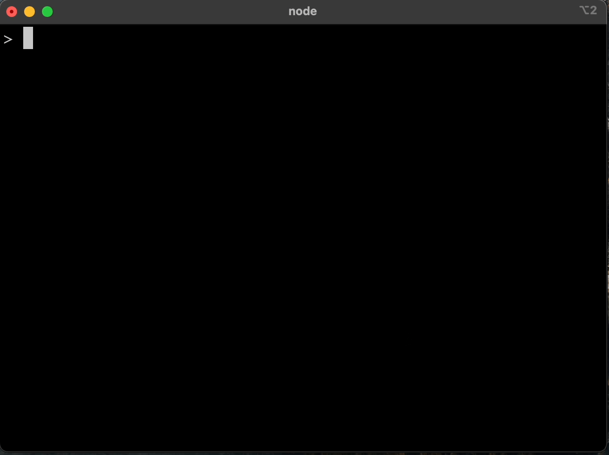
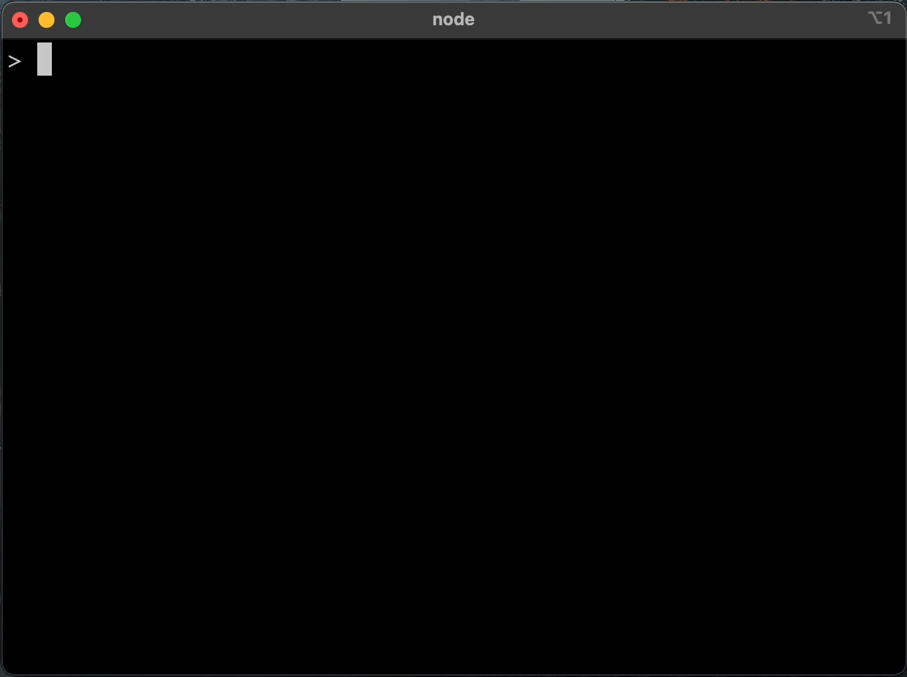

# Tiny Track
[](https://www.npmjs.com/package/tiny-track)

A minimalistic dependency free logger that supports the transport of logs into multiple streams, and can also work both in the browser and in nodejs environments.

Besides, it provides other minimalistic approach to use logger through using tagged template: 

```js
import { tinyTrack } from 'tiny-track';

// One stream
const tt = tinyTrack({
    colorize: true,
    format: 'json',
    stream: process.stdout
}})
```

Where `tt` is [Tagged Template](https://developer.mozilla.org/en-US/docs/Web/JavaScript/Reference/Template_literals#tagged_templates), which can take any numbers of placeholders with data you want to log. 

## Pretty format example



## JSON format example



## Install

```sh
npm install tiny-track
```

## Usage

```js
import { tinyTrack } from 'tiny-track';

// One stream
const tt = tinyTrack({
    colorize: true,
    format: 'json',
    stream: process.stdout
}})
```

```js 

// Or multiple streams

const tt = tinyTrack([
  { colorize: true, stream: process.stdout, format: 'pretty', maxDepth: 5 },
  {
    level: ['debug', 'warn'],
    colorize: false,
    stream: fs.createWriteStream(path.resolve(process.cwd(), 'debug.log')),
  },
  {
    level: 'error',
    colorize: false,
    stream: fs.createWriteStream(path.resolve(process.cwd(), 'error.log')),
  },
])

// Browser compatible logger

const tt = tinyTrack({
    colorize: false,
    format: 'json', // or 'pretty'
}})

```

## Log Levels 
There are 4 log levels
- info (default) - `tt\`<log-message>[...<any-data>]\``
- error - `tt\`!<log-message>[...<any-data>]\``,  The exclamation mark `!` at the beginning indicates that is error
- wann  - `tt\`w!<log-message>[...<any-data>]\``, The message should start with  `w!`
- debug  - `tt\`d!<log-message>[...<any-data>]\``, The message should start with `d!`
